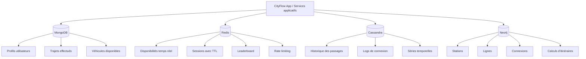

# Architecture CityFlow - Persistance Polyglotte

## 1. Vue d'ensemble

CityFlow adopte une architecture de **persistance polyglotte** : chaque type de donnée est
stocké dans la base de données la mieux adaptée à ses contraintes d'accès, de volume et de
structure. Quatre bases NoSQL cohabitent, orchestrées par Docker Compose.

```
┌─────────────────────────────────────────────────────────────────┐
│                      Application CityFlow                       │
│                   (couche applicative - hors périmètre)         │
└───────┬───────────────┬──────────────────┬──────────────────────┘
        │               │                  │                  │
        ▼               ▼                  ▼                  ▼
  ┌──────────┐   ┌──────────┐   ┌─────────────┐   ┌──────────────┐
  │ MongoDB  │   │  Redis   │   │  Cassandra  │   │    Neo4j     │
  │  :27017  │   │  :6379   │   │    :9042    │   │  :7687/:7474 │
  │          │   │          │   │             │   │              │
  │ Profils  │   │  Cache   │   │   Logs de   │   │   Réseau de  │
  │ Trajets  │   │Sessions  │   │  passages   │   │   transport  │
  │Véhicules │   │Leaderbd. │   │(time-series)│   │  (graphe)    │
  └──────────┘   └──────────┘   └─────────────┘   └──────────────┘
```



Chaque base est spécialisée pour un besoin précis. MongoDB stocke les données métier riches, Redis gère le temps réel et les données éphémères, Cassandra absorbe les écritures massives horodatées, et Neo4j modélise naturellement le réseau de transport sous forme de graphe.

## 2. Répartition des responsabilités

### MongoDB - Données métier riches et flexibles

**Ce qu'on stocke :** profils utilisateurs, historique des trajets, catalogue des véhicules.

**Pourquoi MongoDB :**
- *En tant qu'utilisateur*, les trajets sont des documents imbriqués (étapes GPS, commentaires, véhicule associé) qu'il serait coûteux de normaliser en SQL : une lecture = un document, pas de JOIN.
- *En tant qu'administrateur*, lister les véhicules par type et arrondissement (US-M2) se fait en une requête indexée sans table de jointure.
- *En tant qu'analyste*, les agrégations (top conducteurs, distance moyenne - US-M3) sont natives avec le framework Aggregation ; le schéma évolue sans migration (ajout d'un champ `eco_score`).
- *En tant que développeur*, l'index full-text sur les commentaires couvre US-M4 sans infrastructure externe.

**Ce qu'on ne fait pas avec MongoDB :**
- Données à faible latence temps-réel → Redis
- Séries temporelles à haut débit d'écriture → Cassandra
- Traversées de graphe → Neo4j

### Redis - Temps réel et performances

**Ce qu'on stocke :** disponibilités de stations (STRING), sessions utilisateurs (HASH + TTL),
classement mensuel (SORTED SET), compteurs de rate limiting (STRING + TTL).

**Pourquoi Redis :**
- *En tant qu'utilisateur*, la disponibilité des stations (US-R1) et la session active 30 min (US-R2) exigent une latence sous la milliseconde - MongoDB à 20-50 ms est inacceptable ici.
- *En tant qu'utilisateur*, le classement des conducteurs les plus actifs (US-R3) est maintenu en O(log n) par le Sorted Set, sans recalcul à la lecture.
- *En tant que développeur*, l'expiration automatique (TTL) gère les sessions et les fenêtres de rate limiting (US-R4) sans cron job ni colonne `expires_at`.
- Complète MongoDB : Redis cache les données chaudes, MongoDB persiste les données froides.

**Ce qu'on ne fait pas avec Redis :**
- Persistance durée de vie longue → MongoDB ou Cassandra
- Requêtes ad-hoc sur des données structurées → MongoDB

### Cassandra - Historique massif et time-series

**Ce qu'on stocke :** événements de passage aux stations (`station_passages`), connexions
utilisateurs par mois (`user_connexions`), statistiques journalières agrégées
(`daily_station_stats` avec COUNTER).

**Pourquoi Cassandra :**
- *En tant que système*, absorber plusieurs milliers d'événements de passage par minute (US-C2) sans dégradation : Cassandra est optimisée pour les **écritures massives** (1000+ stations × 1 événement/min = millions d'insertions/jour).
- *En tant qu'analyste*, retrouver l'historique d'une station sur une période (US-C1) et l'évolution journalière des passages (US-C4) : la **Partition Key** `(station_id, day)` garantit des lectures en O(1), sans scan global.
- *En tant qu'utilisateur*, consulter ses 30 derniers jours de connexions (US-C3) : la partition `(user_id, month)` isole les données de chaque utilisateur.
- La scalabilité horizontale (ajout de nœuds) est transparente et sans downtime.

**Ce qu'on ne fait pas avec Cassandra :**
- Jointures ou requêtes ad-hoc → MongoDB
- Traversées relationnelles → Neo4j

### Neo4j - Réseau et itinéraires

**Ce qu'on stocke :** nœuds `:Station` (15 stations lyonnaises), nœuds `:Line` (4 lignes),
relations `:CONNECTED_TO` (durée en minutes), relations `:SERVES` (ordre sur la ligne).

**Pourquoi Neo4j :**
- *En tant qu'utilisateur*, calculer le plus court chemin entre deux stations (US-N1), trouver les stations accessibles en moins de 15 minutes (US-N2) et vérifier l'existence d'un trajet sans correspondance (US-N4) : ces traversées sont natives en Cypher, impossibles à écrire simplement en SQL.
- *En tant que planificateur*, identifier les stations hubs (US-N3) pour optimiser le réseau : un `count()` sur les relations `:CONNECTED_TO` suffit.
- Un réseau de transport **est un graphe** : les relations entre stations sont le cœur du modèle. `shortestPath` et `apoc.algo.dijkstra` sont optimisés nativement.
- Ajout de nouvelles lignes ou connexions → juste de nouveaux nœuds et relations, sans modification de schéma.

**Ce qu'on ne fait pas avec Neo4j :**
- Données volumétriques séquentielles → Cassandra
- Documents riches non-relationnels → MongoDB

## 3. Interactions entre bases

Dans une application réelle, les bases communiquent via la couche service :

```
Requête utilisateur « Planifier un trajet »
  1. Neo4j       → Calcul du plus court chemin (stations + temps)
  2. Redis        → Vérifier la disponibilité des stations en temps réel
  3. MongoDB     → Créer le trajet dans l'historique utilisateur
  4. Cassandra   → Logger l'événement de passage à chaque station
```

Pour ce projet, chaque base est interrogée indépendamment via ses propres scripts et requêtes.

## 4. Choix de ne pas utiliser un SGBD relationnel

Une base SQL unique (PostgreSQL) aurait pu stocker toutes ces données, mais au prix de :
- **Schémas rigides** pour les trajets (difficile d'imbriquer des étapes GPS sans JSONB).
- **Performances dégradées** pour les time-series (pas d'optimisation native des partitions
  par date).
- **Absence de primitives graphe** (le plus court chemin en SQL = procédures stockées
  complexes ou extension PostGIS/pgRouting).
- **Latence incompatible** avec les besoins temps réel (sessions, disponibilités).

Le surcoût opérationnel (4 bases à maintenir) est justifié par les gains fonctionnels et de
performance pour chaque domaine.
